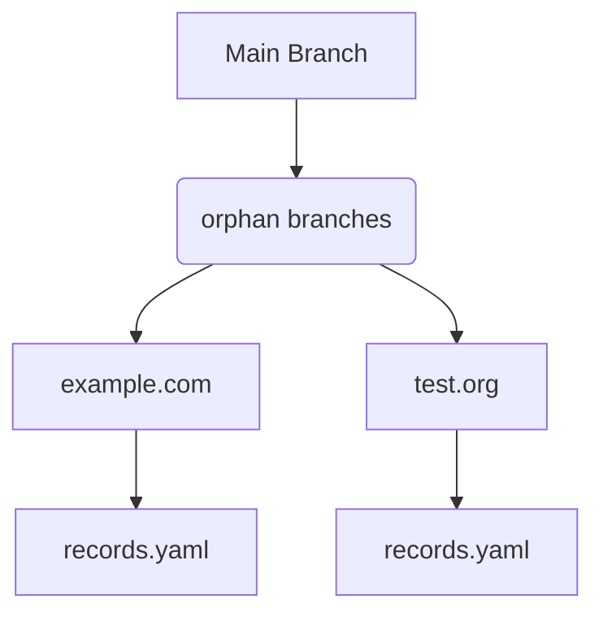
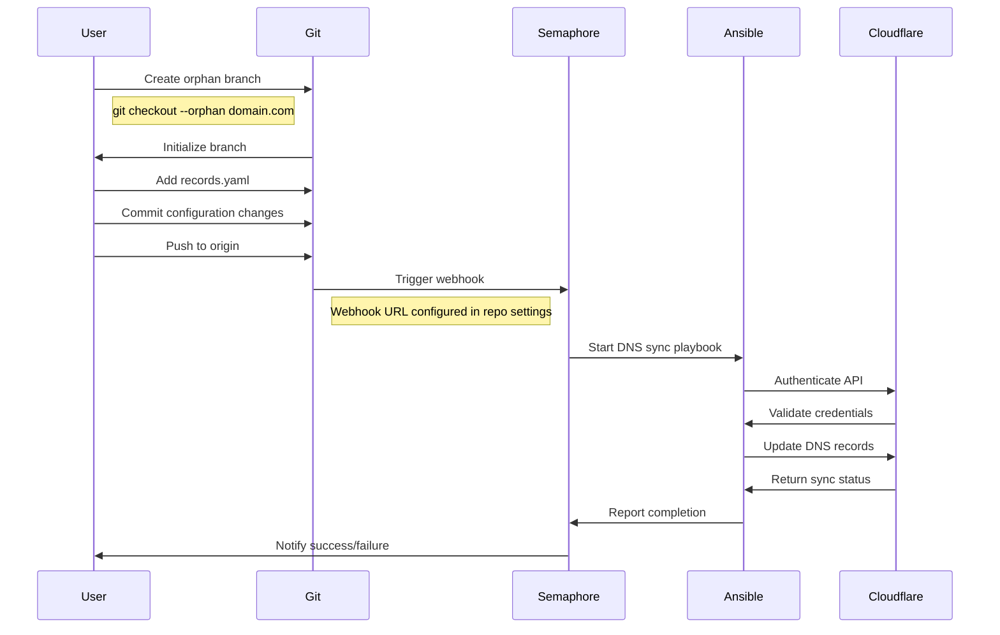
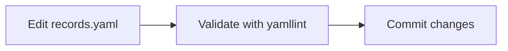
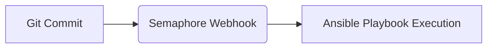
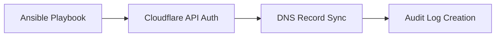

# Cloudflare DNS Records Management System

[]()
[]()
[]()
[]()

Automated DNS configuration synchronization between YAML files and Cloudflare domains using Git-driven workflows and Ansible automation.

---

## 📑 Table of Contents <a id="table-of-contents"></a>

- [Overview](#overview)
- [Key Features](#key-features)
- [Requirements](#requirements)
  - [Local Environment Setup](#local-environment-setup)
  - [External Services](#external-services)
- [Repository Structure](#repository-structure)
- [Branch Workflow](#branch-workflow)
  - [Branch Creation Process](#branch-creation-process)
- [Automation Pipeline](#automation-pipeline)
  - [Configuration Stage](#configuration-stage)
  - [Trigger Stage](#trigger-stage)
  - [Execution Stage](#execution-stage)
- [Security Implementation](#security-implementation)
  - [Credential Setup](#credential-setup)
- [Best Practices](#best-practices)
- [Troubleshooting Guide](#troubleshooting-guide)
  - [Common Errors](#common-errors)
  - [Debugging Workflow](#debugging-workflow)

---

## Overview <a id="overview"></a>

This repository implements a declarative DNS management system for Cloudflare domains through:

1. YAML-based configuration files
2. Git version control for audit trails
3. Automated DNS (A,AAA,CNAME) synchronization via Ansible/Semaphore
4. Orphan branch per-domain isolation strategy

---

## Key Features <a id="key-features"></a>

- **Git-controlled DNS**: Full version history of DNS changes  
- **Declarative management**: Desired state defined in `records.yaml`  
- **Automated sync**: Real-time updates through webhook triggers  
- **Domain isolation**: Separate branches prevent cross-domain conflicts  
- **Audit-ready**: Complete change history through Git commits  

---

## Requirements <a id="requirements"></a>

### Local Environment Setup <a id="local-environment-setup"></a>

1. [SCM](https://about.gitea.com/) - Repository hosting with webhook capabilities  
2. [Yamllint](https://yamllint.readthedocs.io/) - Configuration validation  

### External Services <a id="external-services"></a>

1. [Ansible Semaphore](https://semaphoreui.com/) - Automation orchestration  
2. [Ansible Cloudflare Collection](https://docs.ansible.com/ansible/latest/collections/community/general/cloudflare_dns_module.html) - Ansible Collection  
3. [Cloudflare Account & API Token](https://developers.cloudflare.com/api/) - API integration  

---

## Repository Structure <a id="repository-structure"></a>

Each domain exists in its own orphan branch containing only one file:



**records.yaml** format:

```yaml
# Cloudflare DNS configuration for the zone
cloudflare_zone: example.net
cloudflare_zone_id: YOUR_ZONE_ID_HERE  # Found on the Cloudflare Dashboard → Overview page

records:
  # A record (IPv4 address)
  - type: A
    name: www                 # Full domain: www.example.net
    content: 192.0.2.1          # IPv4 address
    proxied: true               # true = proxied through Cloudflare, false = DNS only

  # CNAME record (alias)
  - type: CNAME
    name: blog                # Full domain: blog.example.net
    content: example.net        # Canonical name to point to
    proxied: false              # CNAMEs can also be proxied or DNS only

  # AAAA record (IPv6 address)
  - type: AAAA
    name: ipv6                # Full domain: ipv6.example.net
    content: 2001:db8::1        # IPv6 address
    proxied: true
```

---

## Branch Workflow <a id="branch-workflow"></a>

Git branch strategy for domain management:



### Branch Creation Process <a id="branch-creation-process"></a>

```bash
# Create new domain branch
git checkout --orphan example.com
# Remove existing files
git rm -rf .
# Create records.yaml
echo "records: []" > records.yaml
# Commit initial structure
git add records.yaml && git commit -m "Initial commit"
# Push to origin
git push origin example.com
```

---

## Automation Pipeline <a id="automation-pipeline"></a>

### Configuration Stage <a id="configuration-stage"></a>



### Trigger Stage <a id="trigger-stage"></a>



### Execution Stage <a id="execution-stage"></a>



---

## Security Implementation <a id="security-implementation"></a>

Critical security measures:

- **Credential Storage**: Cloudflare API tokens stored in Semaphore's encrypted vault  
- **Branch Protection**: Require pull requests for production branch changes  
- **Audit Trail**: Git commit history tracks all configuration modifications  
- **Secret Rotation**: Regular token rotation through Semaphore UI  

### Credential Setup <a id="credential-setup"></a>

1. Generate Cloudflare API token with DNS permissions  
2. In Semaphore UI:  
   - Navigate to Project Settings > Credentials  
   - Add new credential with Cloudflare token  
   - Link to Ansible playbook environment variables  

---

## Best Practices <a id="best-practices"></a>

| Practice              | Implementation                     | Rationale                       |
| --------------------- | ---------------------------------- | ------------------------------- |
| One Domain Per Branch | Use orphan branches                | Prevent configuration conflicts |
| YAML Validation       | Run `yamllint` before commits      | Avoid syntax errors             |
| Protected Branches    | Enable branch protection rules     | Prevent direct modifications    |
| Separate Environments | Create staging/production branches | Test changes safely             |
| Regular Audits        | Review commit history monthly      | Maintain compliance             |

---

## Troubleshooting Guide <a id="troubleshooting-guide"></a>

**Q:** Why aren't DNS changes appearing in Cloudflare?  
**A:** Verify:

1. Webhook URL matches branch name in Semaphore  
2. Ansible playbook has valid Cloudflare credentials  
3. No YAML syntax errors in `records.yaml`  

---

### Common Errors <a id="common-errors"></a>

| Error Message         | Solution                          |
|-----------------------|-----------------------------------|
| "Invalid API token"   | Update credentials in Semaphore   |
| "Branch not found"    | Verify orphan branch exists       |
| "YAML parse error"    | Run `yamllint` on configuration   |
| "Permission denied"   | Check branch protection settings  |

---

### Debugging Workflow <a id="debugging-workflow"></a>

1. Check Semaphore job logs for execution details  
2. Validate YAML with:

```bash
yamllint records.yaml
```

3. Verify webhook payload delivery in Git provider UI  

---

[⬆️ Back to Top](#table-of-contents)
**THIS REPOSITORY IS ENCRYPTED. IF YOU'RE HERE, YOU'RE EITHER VERY BRAVE OR VERY LOST. EITHER WAY, GOOD LUCK!**
